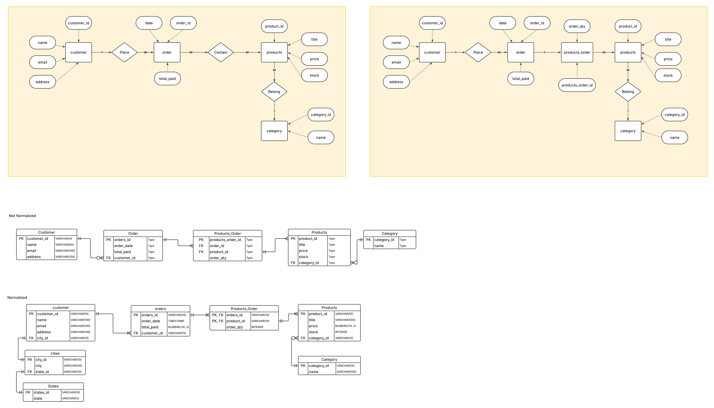
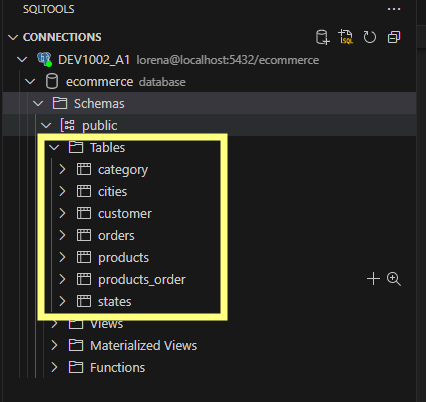

# Relational Database Scenario

This project models a relational database for an online store that sells hair care products across different categories. 

Each customer can place multiple orders, and each order can include several products. 

This project support business analyze performance and customer behavior. The system keeps track of customers, the items they purchase, and how much they have spent in store. Also it can calculate the total revenue per category, the average order value per customer.

# Normalization
## Concepts
1NF
- All rows must be unique (no duplicate rows)
- Each cell must only contain a single value (not a list)
- Each value should be non divisible (must be atomic)

2NF
- No partial dependencies (fully dependend of Primary Key)
- Database must be in 1NF

3NF
- No transitive dependencies (All fields must only be determinable by the PK not by other keys)
- Database must be in 1NF and 2NF

# ERD Charts

These ERD diagrams were developed by following the structured approach introduced in class. The process began with identifying entities, their attributes, and the relationships between them. Cardinality was then defined, followed by the application of data normalization principles to refine the table structures.

## Tables created

Those 7 tables were created after the final Entity Relational Diagram.

